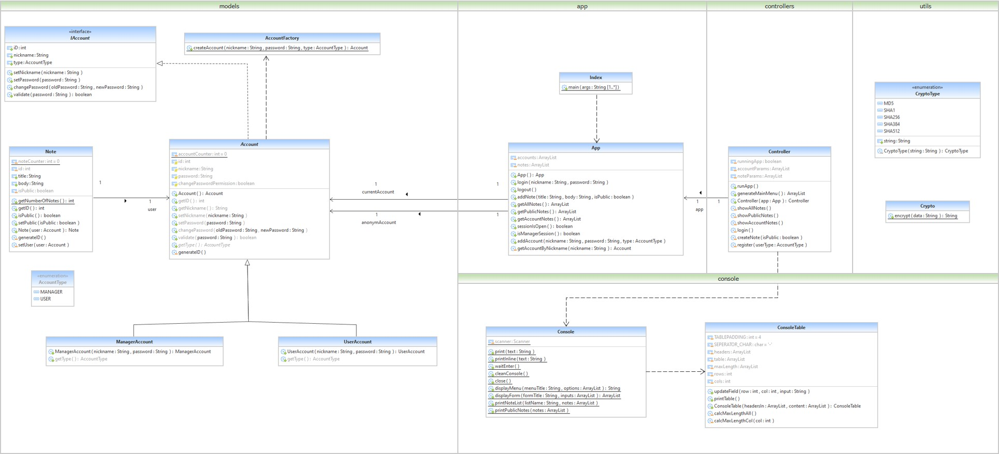

# Java Console App Template
This repository is an example of how to make a console project in Java. This project implements the `model-view-controller` architecture despite its simplicity in the user interface module (`Console` class). The structure of project is as follows:

* `src`: contains all source code of project.
* `test`: contains all test code of project.
* `com`: contains all company applications.
* `app`: is the source code of application.
* `console`: user interface package (view).
* `controllers`: control package (controller).
* `models`: model package (model).
* `utils`: util package.
* `App.java`: is the main class of application.
* `Index.java`: is the start class of application.

## Class Diagram
This is the class diagram of this project:

